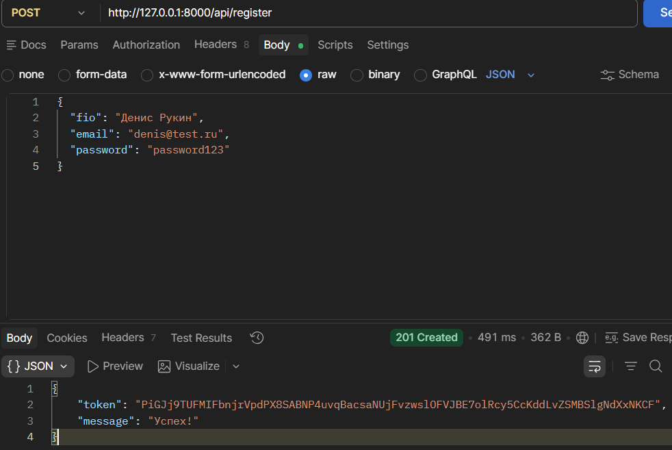

# Survey API — Система управления опросами

RESTful API сервис для проектирования, публикации и прохождения опросов. Система обеспечивает полный цикл работы с анкетами: от создания черновика до сбора и валидации ответов респондентов.

## Основные возможности

* **Управление жизненным циклом**: Поддержка статусов `draft` (Черновик), `published` (Опубликованый) и `closed` (Закрыт).
* **Защита целостности**: Программный запрет на изменение структуры (вопросы и варианты) после публикации опроса.
* **Типизация вопросов**: Разграничение логики для текстовых ответов и выбора из вариантов.
* **Строгая валидация**: Проверка на пустые значения в текстовых ответах и обязательный выбор опций.
* **Защита от повторов**: Блокировка повторного прохождения опроса одним и тем же пользователем.
* **Ролевая модель**: Разграничение прав доступа (Автор / Респондент) через API-токены.

## Технологический стек

* **Framework:** Laravel (PHP)
* **Database:** MySQL
* **Auth:** API Token Authentication (Bearer)
* **Testing:** Postman

---

## База данных и архитектура хранения

Проект базируется на реляционной модели данных, обеспечивающей строгую связность между пользователями, их ролями, структурой опросов и результатами прохождения.

### Перечень таблиц и назначение полей
| Таблица | Первичный ключ | Описание полей |
| :--- | :--- | :--- |
| **users** | `id` | ФИО, Email, Хэш пароля, API-токен и роль пользователя. |
| **role** | `id_role` | Справочник ролей: Автор и Респондент. |
| **survey** | `id_survey` | Заголовок, описание, статус (`draft`, `published`, `closed`) и ID создателя. |
| **question** | `id_question` | Текст вопроса, ID опроса и ID типа (текст/выбор). |
| **answer_type** | `id_type` | Справочник типов: 1 — Одиночный, 2 — Множественный, 3 — Текст. |
| **question_options** | `id_option` | Текст варианта ответа и связь с вопросом. |
| **answer** | `id` | Результирующая таблица: связь пользователя, опроса, вопроса и самого ответа. |

### Схема связей
Логика взаимодействия сущностей построена по принципу обеспечения ссылочной целостности:

* **Пользователи и Роли**: `users.role_id` → `role.id_role` (Многие к одному). Каждый пользователь имеет строго определенные права доступа.
* **Опросы и Авторы**: `survey.creator_id` → `users.id` (Многие к одному). Опрос всегда привязан к его создателю.
* **Вопросы и Типы**: `question.type_id` → `answer_type.id_type` (Многие к одному). Определяет механику валидации ответа.
* **Структура опроса**: `question.survey_id` → `survey.id_survey` и `question_options.question_id` → `question.id_question`. Каскадная связь для хранения вложенных элементов.
* **Сбор ответов**: Таблица `answer` связывает все ключевые сущности (`users`, `survey`, `question`, `question_options`), аккумулируя результаты в одном месте.

> **Механика работы:**
> Архитектура исключает избыточность данных: жизненный цикл информации начинается с инициализации справочников, продолжается проектированием структуры в статусе черновика и завершается сбором ответов после публикации, при которой внесение изменений в структуру вопросов блокируется программно.
---

## API Эндпоинты

### Аутентификация
| Метод | Эндпоинт | Описание |
| :--- | :--- | :--- |
| POST | `/api/register` | Регистрация нового аккаунта |
| POST | `/api/login` | Получение Bearer токена |
| POST | `/api/logout` | Деавторизация |

> 

### Управление (Для Авторов)
| Метод | Эндпоинт | Описание |
| :--- | :--- | :--- |
| POST | `/api/surveys` | Создание нового черновика |
| POST | `/api/surveys/{id}/questions` | Добавление вопросов (только в `draft`) |
| POST | `/api/questions/{id}/options` | Добавление вариантов (для выбора) |
| PATCH | `/api/surveys/{id}/status` | Публикация или закрытие опроса |

> 
> 
> 

### Прохождение (Для Респондентов)
| Метод | Эндпоинт | Описание |
| :--- | :--- | :--- |
| GET | `/api/surveys/published` | Список доступных опросов |
| GET | `/api/surveys/{id}` | Получение вопросов и вариантов |
| POST | `/api/surveys/{id}/answers` | Отправка ответов на проверку |

---

## Валидация и безопасность

В системе реализованы механизмы контроля данных, предотвращающие ошибки при заполнении:

1.  **Контроль текстовых полей**: Если вопрос требует текстового ответа, поле `text_answer` не может быть пустым (Status `422`).
    > 

2.  **Защита опубликованных данных**: При попытке модифицировать вопросы в активном опросе сервер возвращает ошибку доступа (Status `403`).
    > 

3.  **Жизненный цикл опросов**: При попытках перейти на более старый жизненный цикл (от опубликованного к черновику и от архивного к дургим возникает ошибка) (Status '403').
    > 
    > 

---

## Установка

1.  Клонируйте проект и установите зависимости: `composer install`.
2.  Настройте базу данных в `.env`.
3.  Запустите сервер на MySQL или MariaDB
4.  Создайте базу данных с названием из шага 2
5.  Выполните миграции: `php artisan migrate`.
6.  Запустите локальный сервер: `php artisan serve`.