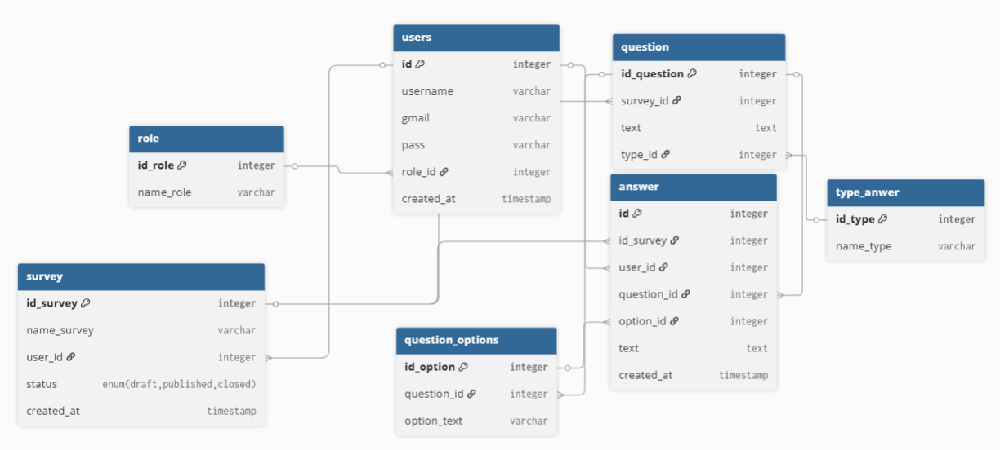
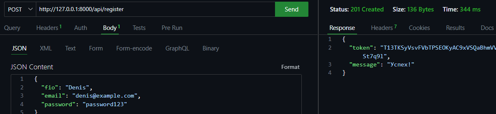

# Преддипломная практика — Бэкенд-разработка

Веб-программирование | 2026

---

## О практике

Цель практики — самостоятельно спроектировать и реализовать REST API для реального сценария использования. Вы выбираете один из двух проектов, проектируете базу данных и структуру API, пишете код, тесты, документацию и упаковываете всё в Docker.

---

## Проекты

В ходе выполнения был выбран проект: [Survey API](./projects/survey-api.md)

---

## Стек

В выборе стека был выбран **PHP** — Laravel

База данных: MySQL

## Как работать

1. **Форкните** этот репозиторий
2. Создайте ветку `dev` — работайте в ней
3. На каждый чекпоинт открывайте **Merge Request** в свой форк: `dev → main`
4. Проводится ревью и комментаруется в MR

## Создание модели

Используя сервис [dbdiagram.io](https://dbdiagram.io) была разработана диаграмма:

Код диаграммы:
Table users {
  id integer [primary key]
  username varchar
  gmail varchar
  pass varchar
  role_id integer [ref: > role.id_role]
  created_at timestamp
}

Table role {
  id_role integer [primary key]
  name_role varchar
}

Table survey {
  id_survey integer [primary key]
  name_survey varchar
  user_id integer [ref: > users.id]
  status enum("draft", "published", "closed")
  created_at timestamp
}

Table question {
  id_question integer [primary key]
  survey_id integer [ref: > survey.id_survey]
  text text
  type_id integer [ref: > type_anwer.id_type]
}

Table type_anwer {
  id_type integer [primary key]
  name_type varchar
}

Table question_options {
  id_option integer [primary key]
  question_id integer [ref: > question.id_question]
  option_text varchar
}

Table answer {
  id integer [primary key]
  id_survey integer [ref: > survey.id_survey]
  user_id integer [ref: > users.id]
  question_id integer [ref: > question.id_question]
  option_id integer [ref: > question_options.id_option, null]
  text text [null]
  created_at timestamp
}

## Разработанные эндпоинты

Были разработаны эндпоинты для:
1) Получения данных по опросникам
2) Вставка значений для регистрации и авторизации

защищённые токеном эндпоинты: 
1) Получения конкретных опросников
2) Ответы
3) Выход из сессии

## Разработка моделей и мутаций

Для каждой таблицы были разработаны модели, а также мутации, которые раставлены по дате в порядке создания, для создания связей

## Проверка эндпоинтов

Проверка была проведена в Thunder client

