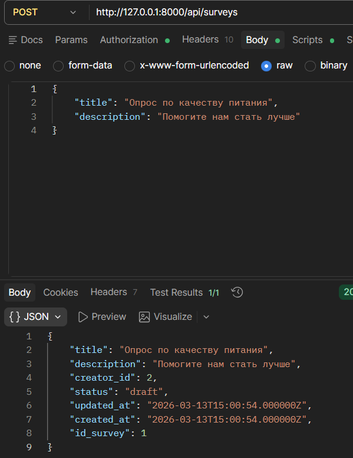
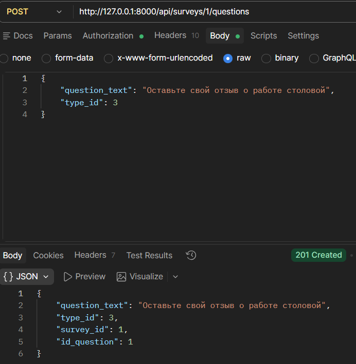
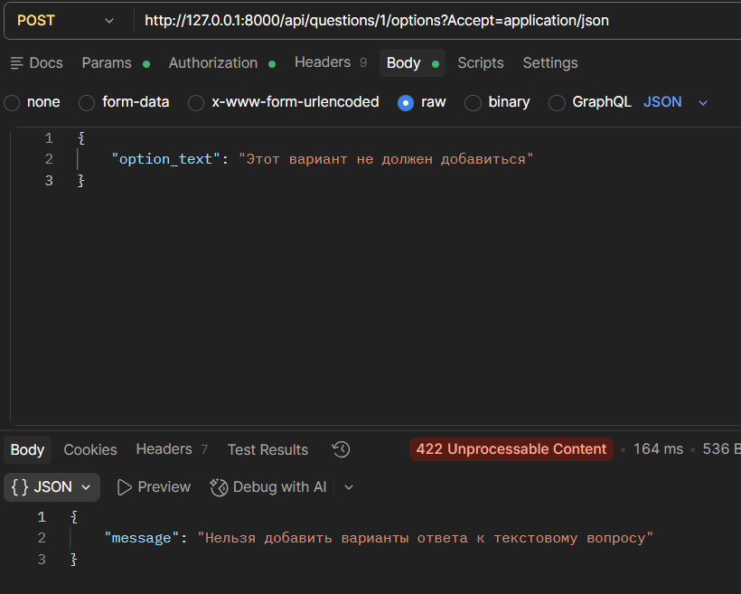
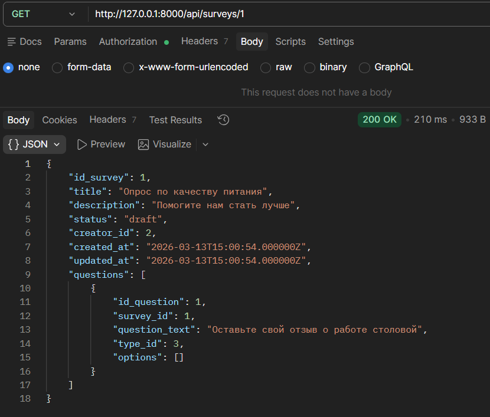

# Преддипломная практика — Бэкенд-разработка

Веб-программирование | 2026

---

## О практике

Цель практики — самостоятельно спроектировать и реализовать REST API для реального сценария использования. В рамках работы проектируется база данных, структура API, реализуется бизнес-логика и документация.

---

## Проекты

В ходе выполнения был выбран проект: **[Survey API](./projects/survey-api.md)**

---

## Стек

В выборе стека был выбран **PHP** — Laravel

* **База данных:** MySQL
* **Инструментарий:** Postman
* **Аутентификация:** API Token (Bearer)

---

## Как работать

1. **Клонируйте** этот репозиторий
2. Настройте подключение к БД в файле `.env`
3. Выполните миграции: `php artisan migrate`
4. Запустите сервер: `php artisan serve`

---

## Создание модели

Используя сервис [dbdiagram.io](https://dbdiagram.io), была разработана диаграмма:

Table users {
  id integer [primary key]
  fio varchar
  email varchar
  password varchar
  api_token varchar
  role_id integer [ref: > role.id_role]
}

Table role {
  id_role integer [primary key]
  name varchar
}

Table survey {
  id_survey integer [primary key]
  title varchar
  description text
  creator_id integer [ref: > users.id]
  status enum("draft", "published", "closed")
}

Table question {
  id_question integer [primary key]
  survey_id integer [ref: > survey.id_survey]
  question_text text
  type_id integer [ref: > answer_type.id_type]
}

Table answer_type {
  id_type integer [primary key]
  name varchar
}

Table question_options {
  id_option integer [primary key]
  question_id integer [ref: > question.id_question]
  option_text varchar
}

Table answer {
  id integer [primary key]
  survey_id integer [ref: > survey.id_survey]
  user_id integer [ref: > users.id]
  question_id integer [ref: > question.id_question]
  option_id integer [ref: > question_options.id_option, null]
  text_answer text [null]
}

---

## Разработанные Эндпоинты

Публичные эндпоинты:

POST /api/register — Регистрация автора

POST /api/login — Авторизация и получение токена

GET /api/surveys — Получение списка всех опросов

Защищённые токеном эндпоинты:

POST /api/surveys — Создание нового опроса

POST /api/surveys/{id}/questions — Добавление вопросов к опросу

POST /api/questions/{id}/options — Добавление вариантов ответов

GET /api/surveys/{id} — Получение полной структуры конкретного опроса

POST /api/logout — Выход из сессии

---

## Реализация моделей и связей

К каждой таблице разработаны модели и их связи (один-ко-многим), особое внимание уделено валидации: реализован программный запрет на добавление вариантов ответа (options) для вопросов с типом "Текст" (type_id: 3).

---

## Проверка эндпоинтов

Проверка была проведена в Postman.

Проверка создания пользователя

Проверка создания опроса

Проверка добавления вопросов

Проверка валидации

Проверка получения данных
